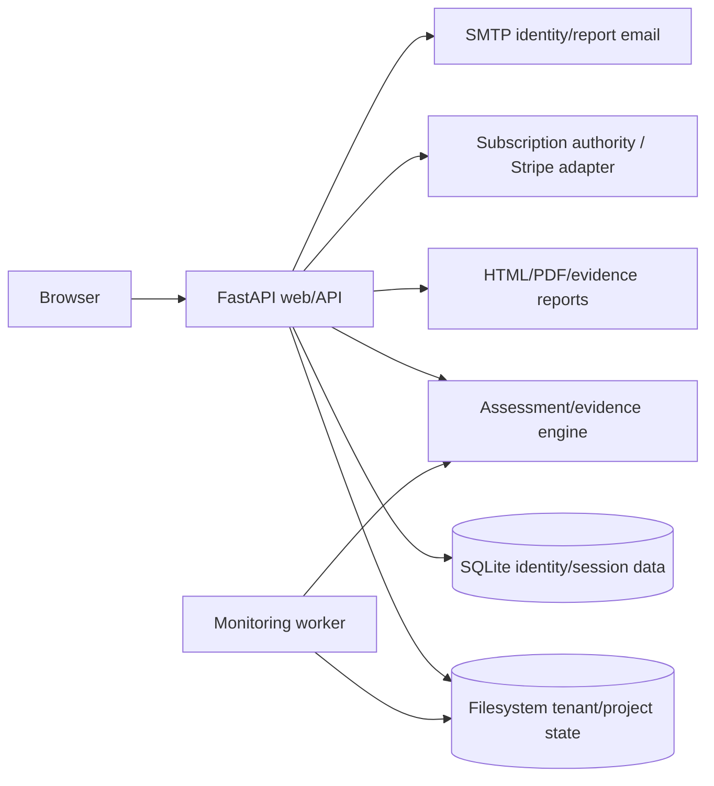

# VERIDRA Architecture

## Runtime

## Major components
1. **Assessment/evidence** — crawling, DNS/IP safety validation, SEO, AI-readiness/crawler policy, trust, accessibility heuristics, passive public security.
2. **Acquisition/prospecting** — discovery/evidence/qualification/visual outreach/local competitive/review-intelligence tooling.
3. **Agency/commercial lifecycle** — authenticated browser workflow for prospects, leads, deals, proposals, customers, projects, tasks, change requests, delivery and recurring lifecycle.
4. **Identity/billing** — signup, email verification, password recovery, invitations, memberships/roles, entitlements, subscription authority, Stripe adapter.
5. **Monitoring/reporting** — report profiles/artifacts, comparisons, monitoring jobs/worker, report delivery.
6. **Production/ops** — runtime validation, trusted hosts/proxy, security headers, access logging, backup/restore, ops checks, deployment acceptance, tenant offboarding.

## Persistence
Current model is SQLite + filesystem tenant state. It is intentionally treated as **single-writer** for production until a shared persistence/concurrency redesign is implemented and tested.

## External interfaces
- SMTP provider: required in production; provider not yet selected/verified for first-customer deployment.
- Stripe: adapter implemented; external resources not yet production/test-provider verified.
- Canonical application host: Rafael's Windows PC, loopback-only (`127.0.0.1`). No public application DNS/TLS/reverse proxy/VPS is required for the Presence Care operating model.
- External SaaS is limited to business workflow dependencies such as SMTP/email and Stripe/accounting when approved.

## Trust/security boundaries
- assessment targets must be public and pass DNS/IP/redirect safety validation;
- no active exploitation/credential attacks/mail probing;
- production hides FastAPI schema/docs and legacy onboarding/health aliases;
- operator-local origin/host boundaries must fail closed and remain loopback-only; public proxy trust is not part of the canonical first-customer model;
- customer secrets/PHI/card data are outside ordinary operational storage;
- external provider state controls billing truth; VERIDRA mirrors operational state.

## Known weaknesses
- single-writer persistence limits horizontal scaling;
- many web workflow modules live in one Python package, so logical module contracts are documentary rather than package-enforced;
- the hardened Windows-local operator profile still needs real-workstation acceptance separate from ordinary development mode;
- production operability remains unproven until the local-runtime, recovery, external-provider and integrated dry-run gates pass.

See `docs/modules/*.CONTRACT.md`, `docs/operations/`, `README.md`.

## 2026-09-25 canonical-host correction
The first-customer architecture is **operator-local Windows**, not cloud-hosted SaaS. Linux/Compose/Caddy/Hetzner artifacts remain optional historical research only. Any future direct-customer hosted application requires a separate explicit architecture decision.
